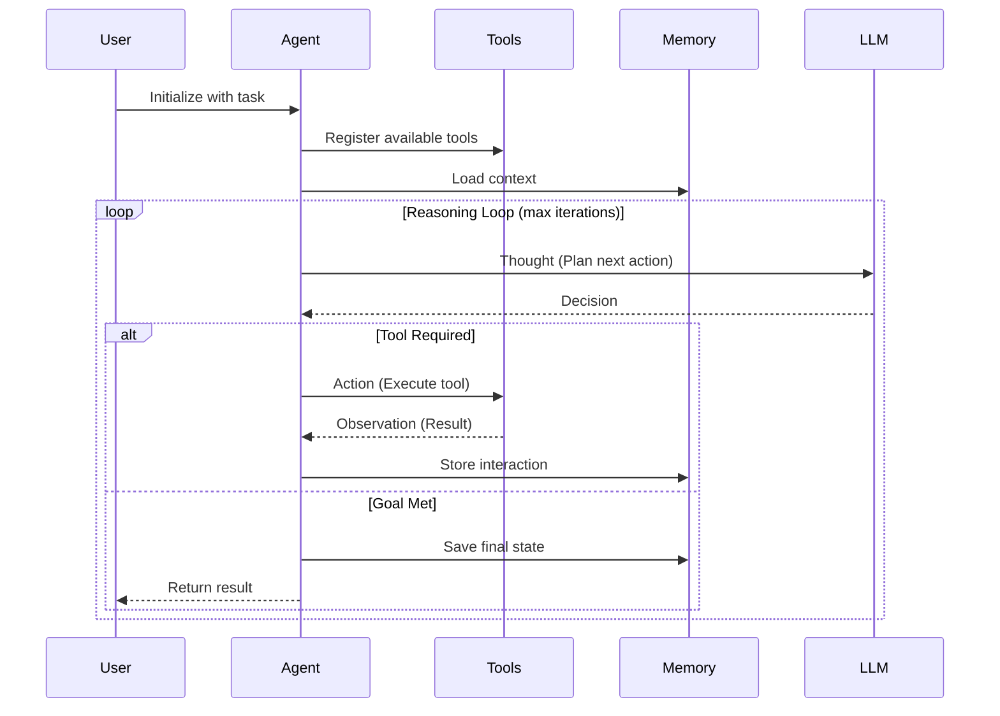

# @dcyfr/ai-agents

<!-- README-META
  tlp_clearance: GREEN
  status: active
  name: dcyfr-ai-agents
  description: Autonomous agent framework template - DCYFR AI starter
  last_validated: 2026-07-11
-->

[](https://deepwiki.com/dcyfr-labs/dcyfr-ai-agents)

> Autonomous agent framework template - Build AI agents with tool usage, memory, and observability

> **📦 Starter Template** — This is a **starter template** for cloning, not an npm package. Use `git clone` or download the source to create your own AI agent application. This package is marked `private: true` and is not published to npm.

[](https://www.typescriptlang.org/)
[](https://nodejs.org/)
[](./tests/)
[](https://github.com/sponsors/dcyfr)
[](LICENSE)


---

## ⚡ 30-Second Quick Start

```bash
# Clone template
npx degit dcyfr-labs/dcyfr-ai-agents my-agent
cd my-agent

# Install and run
npm install
npm run dev
# ✅ Agent running, ready to process tasks
```

---

## 🧭 Related Packages

| Package                                                            | Purpose                | Type        |
| ------------------------------------------------------------------ | ---------------------- | ----------- |
| [@dcyfr/ai](https://github.com/dcyfr-labs/dcyfr-ai)                 | Core AI framework      | npm package |
| [@dcyfr/ai-nodejs](https://github.com/dcyfr-labs/dcyfr-ai-nodejs)   | Node.js starter        | Template    |
| [@dcyfr/ai-api](https://github.com/dcyfr-labs/dcyfr-ai-api)         | REST API template      | Template    |
| [dcyfr-labs](https://github.com/dcyfr-labs/dcyfr-labs)              | Production Next.js app | Application |

> This template declares an **optional peer dependency** on [`@dcyfr/ai`](https://github.com/dcyfr-labs/dcyfr-ai) (`^3.0.3`) — install it if you want the core framework integrations; everything else works without it.

---

## 🎯 Overview

**@dcyfr/ai-agents** is a production-ready starter template for building autonomous AI agents with tool usage, memory management, and comprehensive observability.

## About DCYFR

`@dcyfr/ai-agents` is part of the **DCYFR Labs** template ecosystem for production-ready AI applications.

- **DCYFR** is a registered trademark of DCYFR Labs.
- Primary domain: [www.dcyfr.ai](https://www.dcyfr.ai)
- Licensing details: [LICENSE](./LICENSE)

Perfect for developers building AI assistants, research agents, workflow automation, or any application requiring autonomous decision-making with external tool integration.

## ⚡ Quick Decision: Is This Template Right for Me?

### ✅ Use this template when:

- 🤖 Building autonomous AI agents that make multi-step decisions
- 🛠️ Need type-safe tool usage with Zod validation
- 🧠 Require dual memory architecture (short-term + long-term)
- 📡 Want full observability into agent behavior
- 🔒 Need production-grade error handling and resilience
- 💼 Building customer service bots, research assistants, or code generation tools

### ❌ Consider alternatives when:

- **Simple chat interface needed** → Use [Vercel AI SDK](https://sdk.vercel.ai/) or [LangChain Chat](https://js.langchain.com/)
- **Browser automation required** → Use [Playwright](https://playwright.dev/) with custom orchestration
- **Low-latency streaming (<100ms)** → Use [Vercel AI SDK](https://sdk.vercel.ai/) with streaming
- **Complex agent orchestration** → Use [LangGraph](https://langchain-ai.github.io/langgraph/) or [AutoGPT](https://github.com/Significant-Gravitas/AutoGPT)
- **Just learning AI** → Start with simpler examples before autonomous agents

---

## Table of Contents

<details>
<summary>📑 Table of Contents</summary>

- [Overview](#-overview)
- [Features](#-features)
  - [Core Capabilities](#core-capabilities)
  - [Production Ready](#production-ready)
  - [Use Cases](#use-cases)
- [Quick Start](#-quick-start)
- [Installation](#-installation)
- [Basic Usage](#-basic-usage)
- [Architecture](#️-architecture)
  - [Agent Execution Flow](#agent-execution-flow)
  - [Core Components](#core-components)
- [Examples](#-examples)
- [Testing](#-testing)
- [API Reference](#-api-reference)
- [Documentation](#-documentation)
- [Configuration](#️-configuration)
- [Contributing](#-contributing)
- [License](#-license)

</details>

## ✨ Features

### Core Capabilities

- **🤖 Autonomous Agent Loop** - Multi-step reasoning with configurable iteration limits
  - Thought → Action → Observation cycle
  - Automatic decision-making flow
  - Graceful termination when goals are met

- **🛠️ Type-Safe Tool System** - Production-ready tool framework
  - Zod schema validation for all inputs
  - TypeScript generics for full type safety
  - Built-in tools: calculator, search, time
  - Easy custom tool creation with examples

- **🧠 Dual Memory Architecture** - Flexible persistence options
  - **Short-term**: In-memory with configurable size limits
  - **Long-term**: File-based with auto-save and import/export
  - Async API compatible with any storage backend
  - Perfect for conversation history and learned knowledge

- **📡 Event-Driven Observability** - Complete visibility into agent behavior
  - Real-time events: `start`, `step`, `tool_call`, `tool_result`, `error`, `finish`
  - Multiple event listeners support
  - Custom monitoring and logging integrations
  - Debug agent behavior in development

- **🔒 Production-Grade Error Handling** - Resilient agent execution
  - Try-catch wrappers around all tool executions
  - Graceful degradation on failures
  - Detailed error propagation in results
  - Automatic Error/non-Error normalization

- **📊 Developer Experience** - Built for productivity
  - **TypeScript-first**: 100% strict mode, full IntelliSense
  - **Comprehensive test suite**: Unit, integration, and agent tests with Vitest
  - **Zero config**: Works out of the box
  - **4 complete examples**: Customer service, research, code generation, autonomous research

### Production Ready

- ✅ **Semantic versioning** with automated releases (changesets)
- ✅ **ESLint + Prettier** for code quality
- ✅ **GitHub Actions** for CI/CD
- ✅ **MIT License** for commercial use
- ✅ **Comprehensive documentation** with API reference
- ✅ **Security audited** production dependencies

### Use Cases

Perfect for building:

- 🤝 Customer service chatbots with tool integration
- 🔬 Research assistants that search and synthesize information
- 💻 Code generation agents with file system access
- 🔄 Workflow automation with multi-step reasoning
- 📝 Content creation agents with fact-checking tools
- 🎯 Task planning and execution systems

## 🚀 Quick Start

```bash
# Clone or use as template
git clone https://github.com/dcyfr-labs/dcyfr-ai-agents.git
cd dcyfr-ai-agents

# Install dependencies
npm install

# Run example agent
npm run example:customer-service

# Run tests
npm test

# Build for production
npm run build
```

## 📦 Installation

```bash
npx degit dcyfr-labs/dcyfr-ai-agents my-project
cd my-project
npm install
```

## 💡 Basic Usage

```typescript
import {
  Agent,
  calculatorTool,
  searchTool,
  ShortTermMemory,
} from "@dcyfr/ai-agents";

// Create an agent
const agent = new Agent({
  name: "Assistant",
  description: "Helpful AI assistant",
  tools: [calculatorTool, searchTool],
  memory: new ShortTermMemory(),
  maxIterations: 10,
});

// Run the agent
const result = await agent.run(
  "Calculate 15 * 23 and search for information about AI",
);

console.log(result.output);
console.log(`Completed in ${result.iterations} steps`);
```

## 🏗️ Architecture

### Agent Execution Flow

The agent follows a continuous reasoning loop with tool integration and memory persistence:



### Core Components

#### Agent

The main agent class that orchestrates:

- Decision-making loop
- Tool execution
- Memory management
- Event emission

```typescript
const agent = new Agent({
  name: "My Agent",
  description: "What this agent does",
  maxIterations: 10,
  temperature: 0.7,
  verbose: true,
  tools: [
    /* tools */
  ],
  memory: new ShortTermMemory(),
  listeners: [(event) => console.log(event)],
});
```

#### Tools

Type-safe tools with Zod validation:

```typescript
import { z } from "zod";
import type { Tool } from "@dcyfr/ai-agents";

const myTool: Tool<{ query: string }, { result: string }> = {
  name: "my_tool",
  description: "Description for the agent",
  inputSchema: z.object({
    query: z.string().min(1),
  }),
  async execute(input) {
    // Tool logic here
    return { result: `Processed: ${input.query}` };
  },
};
```

#### Memory

Two memory implementations:

**Short-term (in-memory):**

```typescript
const memory = new ShortTermMemory(100); // Max 100 entries
await memory.save("key", "value");
const value = await memory.get("key");
```

**Long-term (file-based):**

```typescript
const memory = new LongTermMemory({
  storagePath: "./agent-memory.json",
  autoSaveInterval: 5000, // Auto-save every 5s
});

await memory.load();
await memory.save("knowledge", { learned: "data" });
await memory.persist();
```

#### Events

Monitor agent execution:

```typescript
const agent = new Agent({
  // ... config
  listeners: [
    (event) => {
      switch (event.type) {
        case "start":
          console.log("Agent started:", event.data.input);
          break;
        case "tool_call":
          console.log("Calling tool:", event.data.tool);
          break;
        case "finish":
          console.log("Agent finished:", event.data.output);
          break;
      }
    },
  ],
});
```

[⬆️ Back to top](#dcyfrai-agents)

---

## 📚 Examples

### Customer Service Agent

```typescript
import { Agent, searchTool, getCurrentTimeTool } from "@dcyfr/ai-agents";

const agent = new Agent({
  name: "Customer Support",
  description: "Helpful customer service agent",
  tools: [searchTool, getCurrentTimeTool],
});

const result = await agent.run("Help me track my order #12345");
```

### Research Agent

```typescript
import {
  Agent,
  searchTool,
  calculatorTool,
  LongTermMemory,
} from "@dcyfr/ai-agents";

const memory = new LongTermMemory({ storagePath: "./research.json" });
await memory.load();

const agent = new Agent({
  name: "Researcher",
  description: "Research assistant",
  tools: [searchTool, calculatorTool],
  memory,
});

const result = await agent.run(
  "Research AI agent frameworks and compare adoption rates",
);
```

### Custom Tool

```typescript
import { z } from "zod";

const weatherTool = {
  name: "get_weather",
  description: "Get current weather for a location",
  inputSchema: z.object({
    location: z.string(),
    units: z.enum(["celsius", "fahrenheit"]).optional(),
  }),
  async execute(input) {
    // Fetch weather from API
    return {
      location: input.location,
      temperature: 72,
      conditions: "sunny",
    };
  },
};

agent.registerTool(weatherTool);
```

[⬆️ Back to top](#dcyfrai-agents)

---

## 🧪 Testing

```bash
# Run all tests once
npm run test:run

# Watch mode
npm test

# Coverage report
npm run test:coverage
```

### Test Structure

- **Unit tests** - `tests/unit/*.test.ts`
- **Integration tests** - `tests/integration/*.test.ts`
- **Agent tests** - `tests/agent/*.test.ts`
- **Policy binding** - `tests/policy-binding.test.ts`

[⬆️ Back to top](#dcyfrai-agents)

---

## 📖 API Reference

### Agent

- `new Agent(options)` - Create agent instance
- `agent.registerTool(tool)` - Add tool to agent
- `agent.run(input)` - Execute agent with input
- `agent.getState()` - Get current execution state
- `agent.reset()` - Reset agent to initial state

### ToolRegistry

- `registry.register(tool, category?)` - Register tool
- `registry.unregister(toolName)` - Remove tool
- `registry.get(toolName)` - Get tool by name
- `registry.getAll()` - Get all tools
- `registry.execute(toolName, input)` - Execute tool

### Memory

Both `ShortTermMemory` and `LongTermMemory` implement:

- `save(key, value)` - Store value
- `get(key)` - Retrieve value
- `delete(key)` - Remove value
- `clear()` - Clear all data
- `keys()` - List all keys

[⬆️ Back to top](#dcyfrai-agents)

---

## 📚 Documentation

### Getting Started

- **[README](README.md)** - This document (Quick start, architecture, examples)
- **[API Reference](docs/API.md)** - Comprehensive API documentation
- **[Architecture](docs/ARCHITECTURE.md)** - System design and component overview
- **[Version Compatibility](docs/VERSION_COMPATIBILITY.md)** - Supported dependency versions
- **[Examples](examples/)** - Complete working examples:
  - [`customer-service/`](examples/customer-service/) - Customer support agent (`npm run example:customer-service`)
  - [`research-agent/`](examples/research-agent/) - Research and analysis agent (`npm run example:research`)
  - [`code-gen-agent/`](examples/code-gen-agent/) - Code generation agent (`npm run example:code-gen`)
  - [`autonomous-research-agent/`](examples/autonomous-research-agent/) - Standalone autonomous research agent (own package, see its README)
- **[Contributing Guide](CONTRIBUTING.md)** - How to contribute to the project
- **[Security Policy](SECURITY.md)** - Vulnerability reporting and security practices

### Key Concepts

**Agent Loop**: The core execution pattern where the agent iterates through thought → action → observation cycles until completing its task or reaching the maximum iteration limit.

**Tools**: Functions the agent can call to interact with external systems. Each tool has:

- A unique name
- A description the agent uses to decide when to call it
- A Zod input schema for validation
- An execute function that performs the actual work

**Memory**: Persistent storage for the agent to save and retrieve information across runs. Use short-term for conversation context and long-term for learned knowledge.

**Events**: Real-time notifications of agent activity. Subscribe to events for logging, monitoring, debugging, or building custom integrations.

### External Resources

- 🌐 **DCYFR Website**: [https://www.dcyfr.ai](https://www.dcyfr.ai)
- 📧 **Support Email**: [hello@dcyfr.ai](mailto:hello@dcyfr.ai)
- 📚 **Documentation Portal**: [https://docs.dcyfr.ai](https://docs.dcyfr.ai) (coming soon)
- 🐙 **GitHub Organization**: [https://github.com/dcyfr-labs](https://github.com/dcyfr-labs)
- 💬 **Discussions**: [GitHub Discussions](https://github.com/dcyfr-labs/dcyfr-ai-agents/discussions)
- 🐛 **Issue Tracker**: [GitHub Issues](https://github.com/dcyfr-labs/dcyfr-ai-agents/issues)

### Related Projects

- [@dcyfr/ai](https://github.com/dcyfr-labs/dcyfr-ai) - Core AI framework and abstractions
- [@dcyfr/ai-rag](https://github.com/dcyfr-labs/dcyfr-ai-rag) - RAG (Retrieval Augmented Generation) systems
- [@dcyfr/ai-code-gen](https://github.com/dcyfr-labs/dcyfr-ai-code-gen) - Code generation utilities
- [@dcyfr/ai-graphql](https://github.com/dcyfr-labs/dcyfr-ai-graphql) - GraphQL API templates

[⬆️ Back to top](#dcyfrai-agents)

---

## ⚙️ Configuration

### Environment Variables

The core template (`src/`) reads no environment variables — it runs out of the box. [`.env.example`](.env.example) lists optional variables you can wire up as you extend the template:

```bash
# Secrets (1Password reference format shown in .env.example)
OPENAI_API_KEY=            # LLM provider key

# Configuration
OPENAI_API_BASE=
VECTOR_DB_PROVIDER=        # Vector DB integration
VECTOR_DB_URL=
VECTOR_DB_INDEX=
LLM_PROVIDER=              # LLM routing
LLM_MODEL=
LLM_EMBEDDING_MODEL=
TELEMETRY_ENABLED=         # Telemetry
TELEMETRY_STORAGE=
DCYFR_AGENTS_VERSION=
NODE_ENV=
RESEARCH_MAX_DEPTH=        # Example-specific tuning
CS_RESPONSE_TIMEOUT=
CODEGEN_TARGET=
```

The `examples/autonomous-research-agent/` example additionally reads `OPENAI_API_KEY`, `ANTHROPIC_API_KEY`, and `OLLAMA_HOST` to select an available provider.

### TypeScript

Strict mode enabled by default in `tsconfig.json`. Customize as needed.

## 🤝 Contributing

See [CONTRIBUTING.md](CONTRIBUTING.md) for guidelines.

## 📄 License

MIT © DCYFR

## 🔗 Related Templates

- [@dcyfr/ai](https://github.com/dcyfr-labs/dcyfr-ai) - Core AI framework
- [@dcyfr/ai-rag](https://github.com/dcyfr-labs/dcyfr-ai-rag) - RAG systems
- [@dcyfr/ai-graphql](https://github.com/dcyfr-labs/dcyfr-ai-graphql) - GraphQL API
- [@dcyfr/ai-code-gen](https://github.com/dcyfr-labs/dcyfr-ai-code-gen) - Code generation

## 📞 Support

- 📧 Email: hello@dcyfr.ai
- 🌐 Website: https://www.dcyfr.ai
- 📚 Docs: https://docs.dcyfr.ai

---

**Built with ❤️ by DCYFR - Making AI development accessible**
